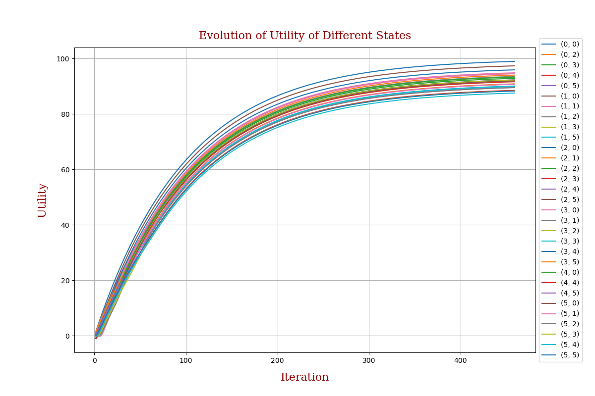
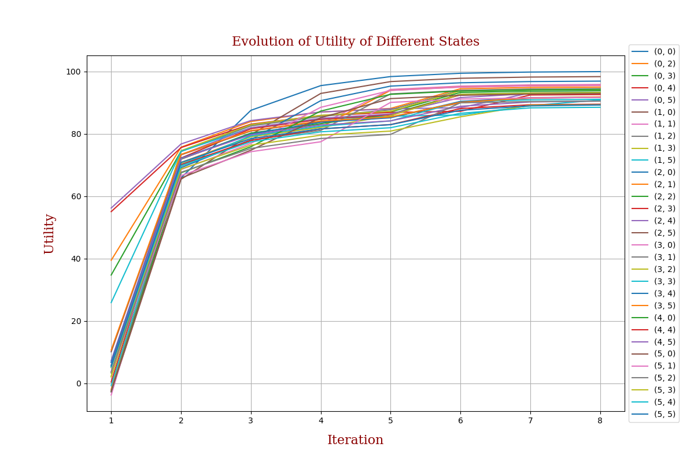
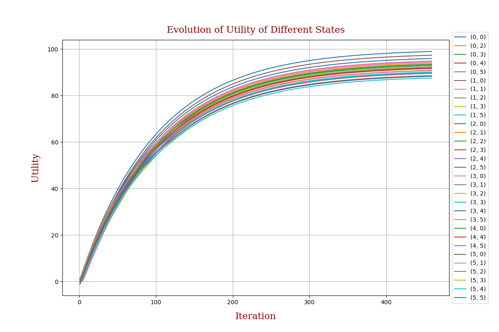
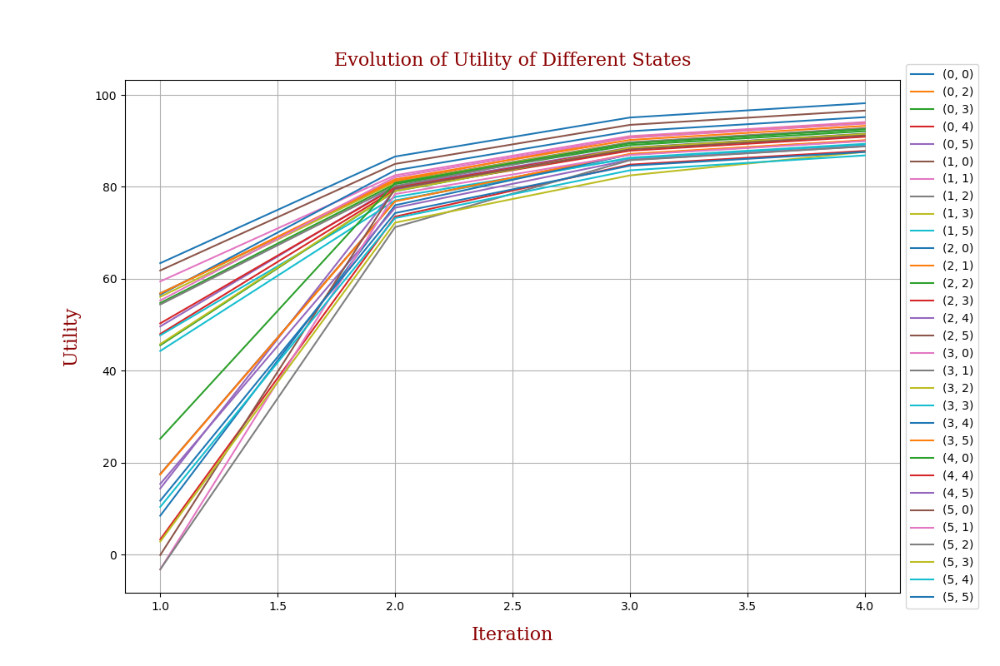
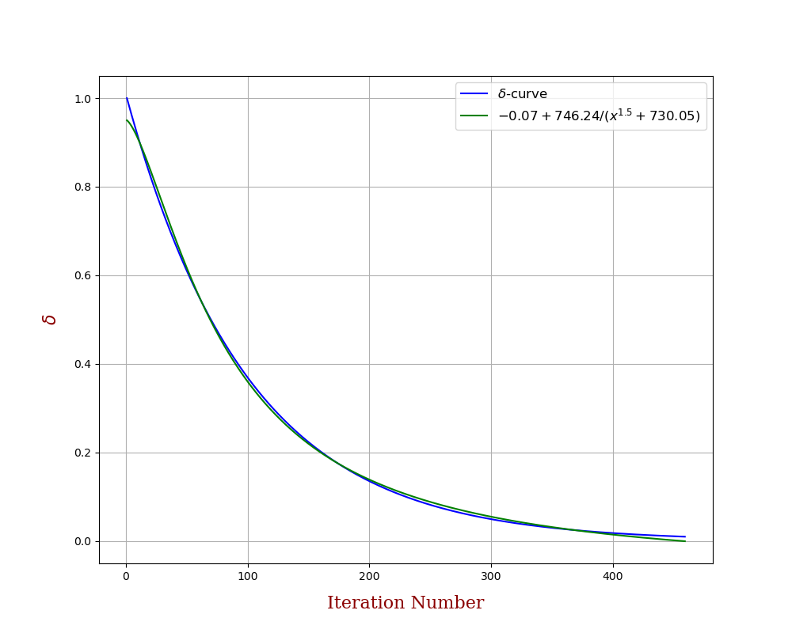
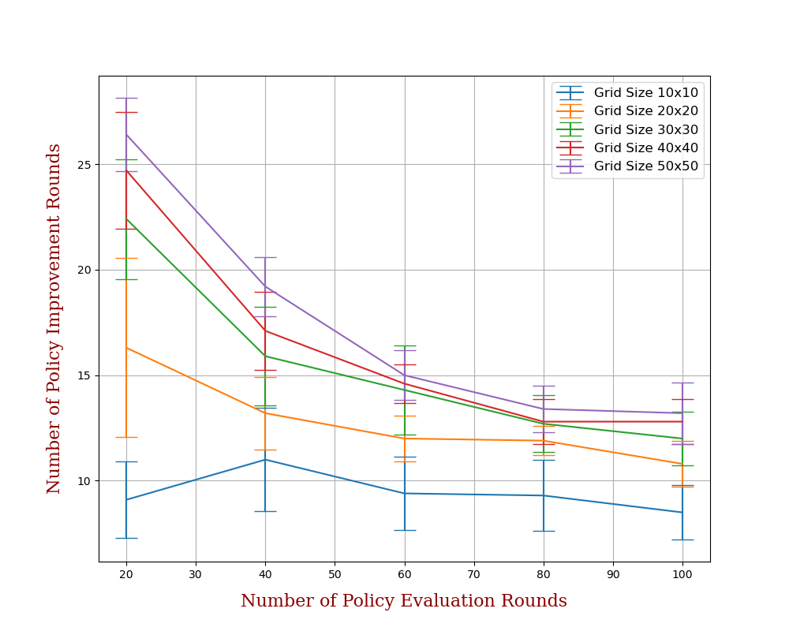

# Assignment 1

## Directory Contents

- `assets/part1/`: contains results for part 1
- `assets/part2/`: contains results for part 2
- `documents/Assignment1-Instructions.pdf`: instructions
- `documents/Assignment1-Submission.pdf`: submission report
- `algorithms/mdp_base.py`: base class for value iterator and policy iterator classes
- `algorithms/value_iteration.py`: defines  value iterator class
- `algorithms/policy_iteration.py`: defines policy iterator class
- `tasks/part1.py`: driver code for part 1
- `tasks/part2.py`: driver code for part 2
- `config.py`: constants and configurations to be used
- `utils.py`: utility function for logging results

## Part 1

To reproduce the results of part 1 of the assignment, execute
```bash
python part1.py
```

You can set the parameters for the run in `config.py`. The results are saved in the directory `assets/part1/`:

- `value-iteration-plot.png`: the plot of evolution of utility values in the Value Iteration run
<p align="center">


- `value-iteration-results.txt`: text file containing the number of iterations required for convergence and the converged utility estimates and the optimal policy in the Value Iteration run

- `policy-iteration-plot.png`: the plot of evolution of utility values in the Policy Iteration run
<p align="center">


- `policy-iteration-results.txt`: text file containing the number of iterations required for convergence and the converged utility estimates and the optimal policy in the Policy Iteration run

## Part 2

To reproduce the results of part 2 of the assignment, execute
```bash
python part2.py --nrows 100 --ncols 100
```

You can set the parameters for the run in `config.py`. The size of the grid can be controlled from the command line using $\texttt{nrows}$ and $\texttt{ncols}$ flags. The results are saved in the directory `assets/part2/{nrows}x{ncols}-grid/`:
- `value-iteration-plot.png`: the plot of evolution of utility values of $30$ randomly selected states in the Value Iteration run
- `value-iteration-results.txt`: text file containing the number of iterations required for convergence and the running time of the algorithm, along with the converged utility estimates and the optimal policy in the Value Iteration run
- `policy-iteration-plot.png`: the plot of evolution of utility values of $30$ randomly selected states in the Policy Iteration run
- `policy-iteration-results.txt`: text file containing the number of iterations required for convergence and the running time of the algorithm, along with the converged utility estimates and the optimal policy in the Policy Iteration run

## Experiment 1

In experiment 1, we changed the value iteration so that the updates in utility values are done in place, i.e., instead of updating utilities using the estimates in previous iteration,

$$
    U^{i+1}\left(s\right) = \mathcal{R}\left(s\right) + \max_{a\in \mathcal{A}\left(s\right)} \sum_{s'\in\mathcal{S}} \mathbb{P}\left(s'|s,a\right) U^{i}\left(s'\right),
$$

we update values in-place,

$$
    U\left(s\right) = \mathcal{R}\left(s\right) + \max_{a\in \mathcal{A}\left(s\right)} \sum_{s'\in\mathcal{S}} \mathbb{P}\left(s'|s,a\right) U\left(s'\right),
$$

Surprisingly, this change barely affects the algorithms:
- Value Iteration requres the exact same number of iterations as in part 1. 
- The number of iterations for Policy Iteration varies over different runs, but is more or less the same. 
- Both algorithms converge to the correct policy.

To reproduce the results of experiment 1, execute
```bash
python exp1.py
```
The results are saved in the directory `assets/exp1/`.

<p align="center">



## Experiment 2

In experiment 2, we change the action space, $\mathcal{A}\left(s\right)$ to contain only moves that don't lead the agent to run into an invalid state: a wall or the edge of the grid. Note that this experiment restricts the arrangement of the grid so that $\mathcal{A}\left(s\right) \neq \phi, \ \forall s \in \mathcal{S}$, i.e., from each state, it is possible for the agent to transition to a different state. We also change the transition model so that
- if both the alternate moves (perpendicular to the agent's intended action) are valid, then the probability of executing the intended action is $0.8$ and $0.1$ for each of the alternate moves. 
- if exactly one of the alternate moves is valid, then the probability of executing the intended action is $0.8$ and $0.2$ for the valid alternate move.
- else, the probability of executing the intended action is $1.0$.

Predictably, the utility values of each state is much lower than in the unconstrained case. However, for both algorithms, the number of iterations required for convergence are similar to as in the unconstrained case.

To reproduce the results of experiment 2, execute
```bash
python exp2.py
```
The results are saved in the directory `assets/exp2/`.

<p align="center">


## Experiment 3

In experiment 3, we observe how the maximum change in utility values, $\delta$, evolves until the Value Iteration algorithm converges.

We can approximate the function mapping the iteration number to $\delta$ using an equation of the form,

$$
    f(x;a,b,c) = a + \frac{b}{x^{1.5}+c}
$$

where the constant $1.5$ is chosen using trial and error. We optimise $f$ using $\texttt{scipy.optimize}$, but with the exponent in the denominator as a parameter, the algorithm performs poorly. So, we manually set it.

To reproduce the results of experiment 3, execute
```bash
python exp3.py --nruns 10 --maxsize 50
```
The results are saved in the directory `assets/exp3/`. 

<p align="center">


$\textbf{Note}$: This constant, $1.5$, would likely not be the same for every grid. Moreover, this functional form would likely not be universal.

## Experiment 4

In experiment 4, we analyze the effect of number of policy evaluations steps on the number of iterations required for convergence of policy iteration algorithm. We work with random grids for this experiment as in part 2.

Interestingly, for smaller grids, the number of evaluation steps seems to have amll impact on the number of improvement steps. But for larger grids, this effect is much more prominent and significant. This could possibly be because, for smaller state spaces, we don't need as many evaluation steps to get a good approximation of the true utility values as we would for larger state spaces

To reproduce the results of experiment 4, execute
```bash
python exp4.py --nruns 10 --maxsize 50
```
The results are saved in the directory `assets/exp4/`. 

<p align="center">


$\textbf{Note}$: The experiment takes a long time to run, so, if you just want to play around or test some changes, set the $\texttt{nruns}$ flag (specifying the number of runs to calculates statistics over) and the $\texttt{maxsize}$ flag (specifying the maximum grid size to work with) low.